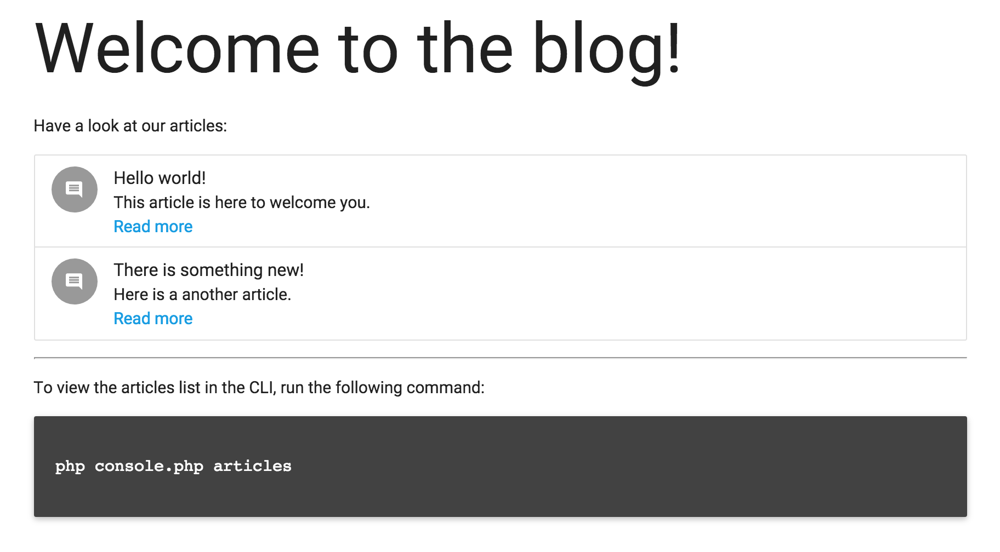

# PHP-DI application demo

This repository demonstrates how to write a simple application using PHP-DI.

## Screenshot



## Run

To run this demo, you need to clone it and install dependencies:

```
git clone https://github.com/PHP-DI/demo.git
cd demo/
composer install
```

You can then run the web application using PHP's built-in server:

```
php -S 0.0.0.0:8000 -t web/
```

The web application is running at [http://localhost:8000](http://localhost:8000/).

You can also run the CLI application:

```
php console.php
```

The following commands are available:

- `articles`: lists the blog articles
- `article [id]`: displays a blog article by its ID
